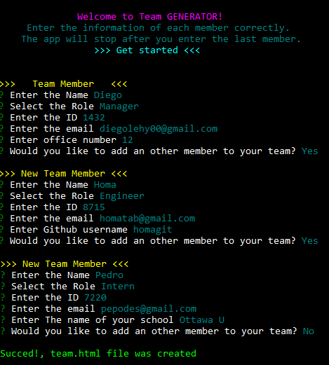
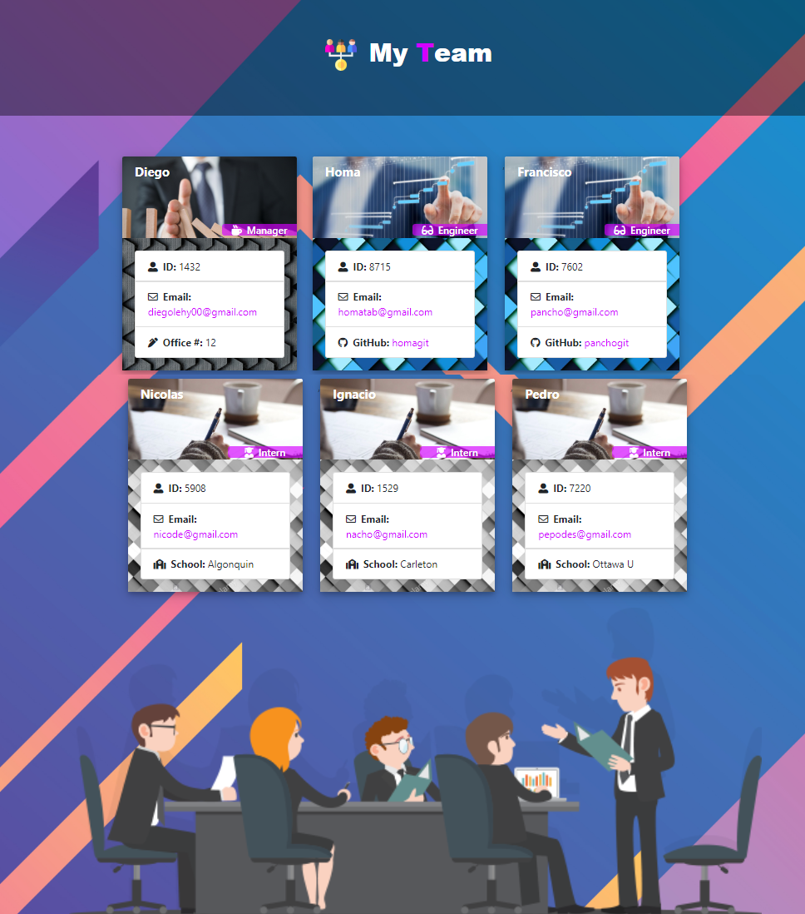
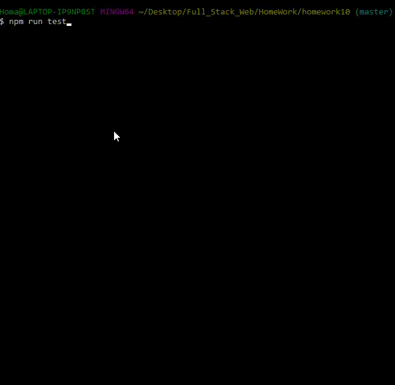
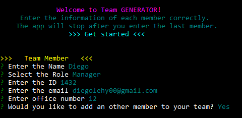
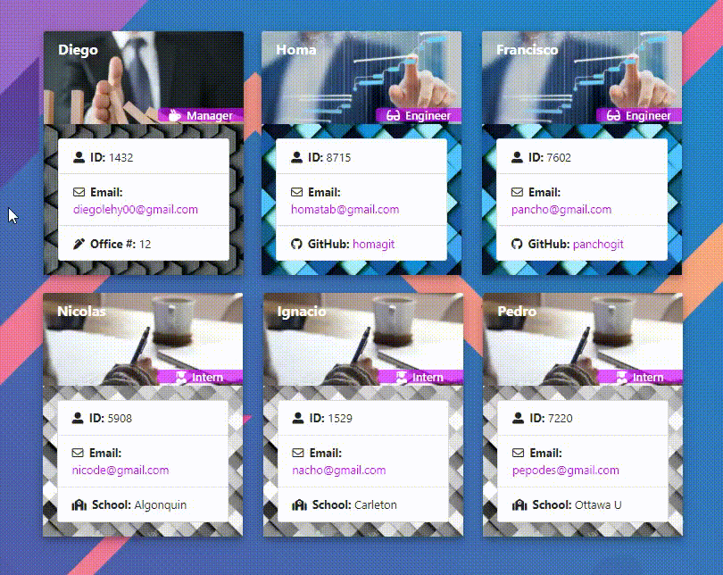

# Team Generator      
### Homework - 10

 node app.js


 Team Page Generated.


## 📌Table of Content

* [Description](#description)
* [Installation](#installation)
* [Usage](#usage)
* [Test](#test)
* [Contributing](#contributing)
* [License](#license)
* [Details](#details)
* [Features](#features)
* [URL](#url)
* [Questions](#questions)

## 📋Description
"Team Generator" is an app that will help you to create HTML pages with the info of your Team members. This app will run in the command line powered by JavaScript, using npm plus the data from the API "Github".
```
As a manager
I want to generate a webpage that displays my team's basic info
so that I have quick access to see it.

```
- Open the app using "command line", (recomended: GitBash).



- Output team.html




## 💿Installation
  ### Prerequisites
    1. Install node.js  
    2. Clone the repository


## ▶️Usage
Answer all the prompt Questions 


## 📊Test
 ```
 npm run test (Jest).
 ```


- All Test passing

## 🤝Contributing  [](code_of_conduct.md)
Feel free to pull request and give me your suggestions if any. This project is under the Contributor Covenant.
          
## ⚖️License  
This project is under the MIT License.

## 📑Details

This repository content the files: JavaScript "app.js", Mit license"LICENSE.txt", "package.json", "package-lock.json", "team.html" generated inside "output" folder, "node_modules" folder and an "image" folder with the captures and gifs for this Readme File.

## 📀Features

- Color Menu

  

- Employee Card

  
 


## 🔗URL  

- The URL to open the repo page on your Browser is "https://diegolehyt.github.io/homework10/"
- Click on the image or the Link to open the Demo on Youtube "https://youtu.be/go7Hk2zJe04"

    [](https://youtu.be/go7Hk2zJe04)

## 👤Questions  
   


✉️ E-mail: diegolehy00@gmail.com